# 计算机体系结构-仿真实验1

## 2112495魏靖轩

[源码GitHub仓库](https://github.com/J1ngxuanWei/Coursework/tree/main/Computer%20Architecture/lab1)

## 实验目的

使用c语言编写一个对于MIPS指令集的仿真程序。

## 实验准备

实验环境配置有点难搞。。。asm2hex年久失修（课程ece447也好难找），随后选择使用MARS手动转换文件（需要JAVA环境）：

下载和官方wiki：[点我](https://courses.missouristate.edu/KenVollmar/MARS/download.htm)，使用的教程：[点我](https://www.bilibili.com/video/BV1au411y7qq/?vd_source=b8dd36605bfa8778525fe77268e66636)

实验指令的中文解析：[点我](https://blog.csdn.net/qq_39559641/article/details/89608132)

~~恳求老师能够下次修一下环境~~

> **因为实验指导书指出并不需要考虑运算中发生的溢出现象，因此程序没有相关的考虑与处理**

## 实验依赖文件分析

首先我们要先看一下我们整个sim的流程是怎样的，根据指导书，我们首先来shell看一下go()和run()函数的运行：

我们发现：运行的本质就是调用一次`cycle()`函数。

那么我们看`cycle()`函数：

```cpp
void cycle() {                                                
  process_instruction();
  CURRENT_STATE = NEXT_STATE;
  INSTRUCTION_COUNT++;
}
```

可以看到，它调用一次我们的`process_instruction()`函数来执行，然后实现状态的切换，然后指令计数加一。

那么我们的执行过程就很有思路了，就是依据命令，进行操作，被操作数是`CURRENT_STATE`，随后将结果保存到`NEXT_STATE`中，然后返回即可。

现在问题来到了如何获取指令上面。我们翻一下shell.c文件，发现了如下的代码：

```cpp
/* Read in the program. */

  ii = 0;
  while (fscanf(prog, "%x\n", &word) != EOF) {
    mem_write_32(MEM_TEXT_START + ii, word);
    ii += 4;
  }

  CURRENT_STATE.PC = MEM_TEXT_START;
```

上面节选自`load_program`函数，至此我们明白了指令应该如何去获得，在初始化的时候我们将.x文件读入了我们设定的内存的text段，上面的代码是写入的部分，因此我们只需要使用`mem_read_32()`函数去读`CURRENT_STATE.PC`就可以获得需要执行的指令了。

## 实验设计

### 前期准备

首先我们要设计读指令的部分，很简单，思路上面已经给出。

```cpp
uint32_t mypc=mem_read_32(CURRENT_STATE.PC);
```

随后是另外一个问题，我们的指令是`uint32_t`类型的，并不能满足我们直接获得操作码、功能码等功能，因此我们希望将这个数转为二进制，每一位都存在一个位置中，整体为一个32大小的int数组，因此我们给出转换代码如下：

```cpp
int mpc[32];
char *pt = (char*)&mypc;
for(int i=0;i<32;i++)
{
    mpc[31-i]=mypc&1;
    mypc/=2;
}
```

这样我们就实现了指令转换为二进制，访问数组即可得到其各位的二进制值。

> **说明**：数组的存储形式为从0~31，依次从高位开始存储（这也与我们常规学习中和参考手册中的从左至右的顺序相同，便于我们理解与操作），例如'3232299786'，十六进制为'0xC0A8FB0A'，二进制为'1100 0000 1010 1000..........'（'C0A8......'），数组的0~15依次为1100 0000 1010 1000。

随后每次执行完一条指令，我们要执行数组清0的操作：

```cpp
memset(mpc,0,sizeof(mpc));
```

然后我们需要对指令进行分类，以便我们设计其执行，使得我们的程序更加模块化。

依据上文中的中文解析，将指令分为如下的几类，总共有53条指令需要实现：

> **因为指令太多较杂，传统分类并不能涵盖所有指令，故在此按照其功能分类，并不按照R型、I型等分类进行，对应处理函数按照op码进行分块**

同时我们还需要一个辅助函数，分别计算数组中第i位到第j位（i<j）的二进制数值所对应的十进制值：

```cpp
uint32_t getdec(int start,int end)
{
    uint32_t res=0;
    int str=1;
    for(int i=end;i>=start;i--)
    {
        res+=mpc[i]*str;
        str*=2;
    }
    return res;
}
```

### 逻辑运算指令

逻辑运算指令共8个，分别为AND、OR、XOR、NOR、ANDI、ORI、XORI、LUI。

#### AND、OR、XOR、NOR

四条指令的op一致，不同的为func。

其各位的分布如下（此处31指最高位，对应数组的最低下标0）：
- 31-26（op）：000000
- 25-21（rs）：*****
- 20-16（rt）：*****
- 15-11（rd）：*****
- 10-6：00000
- 5-0（func）：100100为AND、100101为OR、100110为XOR、100111为NOR

代码如下：

```cpp
switch (getdec(26,31))
    {
    case 36:
        //AND
        NEXT_STATE.REGS[rd]=CURRENT_STATE.REGS[rs]&CURRENT_STATE.REGS[rt];
        break;
    case 37:
        //OR
        NEXT_STATE.REGS[rd]=CURRENT_STATE.REGS[rs]|CURRENT_STATE.REGS[rt];
    case 38:
        //XOR
        NEXT_STATE.REGS[rd]=CURRENT_STATE.REGS[rs]^CURRENT_STATE.REGS[rt];
    case 39:
        //NOR
        NEXT_STATE.REGS[rd]=CURRENT_STATE.REGS[rs]|CURRENT_STATE.REGS[rt];
        NEXT_STATE.REGS[rd]=~NEXT_STATE.REGS[rd];
```

#### ANDI、ORI、XORI

三条指令的按照op区分：001100为ANDI、001101为ORI、001110为XORI

其各位的分布如下（此处31指最高位，对应数组的最低下标0）：
- 31-26（op）：0011**
- 25-21（rs）：*****
- 20-16（rt）：*****
- 15-0（imm）：***************

代码如下：

```cpp
void op12()
{
    //ANDI
    int rs=getdec(6,10);
    int rt=getdec(11,15);
    int imm=getdec(16,31);
    uint32_t high=CURRENT_STATE.REGS[rs]&0xFFFF0000;
    uint32_t low=CURRENT_STATE.REGS[rs]&0xFFFF;
    uint32_t ans=low&imm;
    NEXT_STATE.REGS[rt]=high+ans;
}

void op13()
{
    //ORI
    int rs=getdec(6,10);
    int rt=getdec(11,15);
    int imm=getdec(16,31);
    uint32_t high=CURRENT_STATE.REGS[rs]&0xFFFF0000;
    uint32_t low=CURRENT_STATE.REGS[rs]&0xFFFF;
    uint32_t ans=low|imm;
    NEXT_STATE.REGS[rt]=high+ans;
}

void op14()
{
    //XORI
    int rs=getdec(6,10);
    int rt=getdec(11,15);
    int imm=getdec(16,31);
    uint32_t high=CURRENT_STATE.REGS[rs]&0xFFFF0000;
    uint32_t low=CURRENT_STATE.REGS[rs]&0xFFFF;
    uint32_t ans=low^imm;
    NEXT_STATE.REGS[rt]=high+ans;
}
```

#### LUI

指令作用为：rt ← immediate ll 0，将指令中的16bit立即数保存到地址为rt的通用寄存器的高16位。另外，地址为rt的通用寄存器的低16位使用0填充。

其各位的分布如下（此处31指最高位，对应数组的最低下标0）：
- 31-26（op）：001111
- 25-21：00000
- 20-16（rt）：*****
- 15-0（imm）：***************

代码如下：

```cpp
void op15()
{
    //LUI
    int rt=getdec(11,15);
    uint32_t imm=getdec(16,31);
    imm=imm<<16;
    NEXT_STATE.REGS[rt]=imm;
}
```

### 移位指令

移位指令共6个，分别为SLL、SRL、SRA、SLLV、SRLV、SRAV 。

#### SLL、SRL、SRA、SLLV、SRLV、SRAV

六条指令的op一致，不同的为func。

其各位的分布如下（此处31指最高位，对应数组的最低下标0）：
- 31-26（op）：000000
- 25-21（rs/00000）：*****/00000
- 20-16（rt）：*****
- 15-11（rd）：*****
- 10-6（sa/00000）：*****/00000
- 5-0（func）：000000为SLL、000010为SRL、000011为SRA、000100为SLLV、000110为SRLV、000111为SRAV

代码如下：

```cpp
switch(getdec(26,31))
case 0:
    //SLL
    NEXT_STATE.REGS[rd]=CURRENT_STATE.REGS[rt]<<sa;
    break;
case 2:
    //SRL
    NEXT_STATE.REGS[rd]=CURRENT_STATE.REGS[rt]>>sa;
    break;
case 3:
    //SRA
    uint32_t hi=CURRENT_STATE.REGS[rt]&0x80000000;
    if(hi==1)
    NEXT_STATE.REGS[rd]=(0xFFFFFFFF<<(32-sa))+(CURRENT_STATE.REGS[rt]>>sa);
    else
    NEXT_STATE.REGS[rd]=CURRENT_STATE.REGS[rt]>>sa;
    break;
case 4:
    //SLLV
    uint32_t saa=CURRENT_STATE.REGS[rs]&0x1F;
    NEXT_STATE.REGS[rd]=CURRENT_STATE.REGS[rt]<<saa;
    break;
case 6:
    //SRLV
    uint32_t saa=CURRENT_STATE.REGS[rs]&0x1F;
    NEXT_STATE.REGS[rd]=CURRENT_STATE.REGS[rt]>>saa;
    break;
case 7:
    //SRAV
    uint32_t saa=CURRENT_STATE.REGS[rs]&0x1F;
    uint32_t hi=CURRENT_STATE.REGS[rt]&0x80000000;
    if(hi==1)
    NEXT_STATE.REGS[rd]=(0xFFFFFFFF<<(32-saa))+(CURRENT_STATE.REGS[rt]>>saa);
    else
    NEXT_STATE.REGS[rd]=CURRENT_STATE.REGS[rt]>>saa;
    break;
```

### 移动操作指令

移动操作指令共4个，分别为MFHI、MFLO、MTHI、MTLO。

#### MFHI、MFLO、MTHI、MTLO

四条指令的op一致，不同的为func。

其各位的分布如下（此处31指最高位，对应数组的最低下标0）：
- 31-26（op）：000000
- 25-21（rs/00000）：*****/00000
- 20-16：00000
- 15-11（rd/00000）：*****/00000
- 10-6（00000）：00000
- 5-0（func）：010000为MFHI、010001为MTHI、010010为MFLO、010011为MTLO

代码如下：

```cpp
case 16:
    //MFHI
    NEXT_STATE.REGS[rd]=CURRENT_STATE.HI;
    break;
case 17:
    //MTHI
    NEXT_STATE.HI=CURRENT_STATE.REGS[rs];
    break;
case 18:
    //MFLO
    NEXT_STATE.REGS[rd]=CURRENT_STATE.LO;
    break;
case 19:
    //MTLO
    NEXT_STATE.LO=CURRENT_STATE.REGS[rs];
    break;
```

### 算术操作指令

算术操作指令共14个，分别为ADD、ADDU、SUB、SUBU、SLT、SLTU、ADDI、ADDIU、SLTI、SLTIU、MULT、MULTU、DIV、DIVU 

#### ADD、ADDU、SUB、SUBU、SLT、SLTU

六条指令的op一致，不同的为func。

其各位的分布如下（此处31指最高位，对应数组的最低下标0）：
- 31-26（op）：000000
- 25-21（rs）：*****
- 20-16（rt）：*****
- 15-11（rd）：*****
- 10-6（00000）：00000
- 5-0（func）：100000为ADD、100001为ADDU、100010为SUB、100011为SUBU、101010为SLT、101011为SLTU

> **根据实验指导书，在此不考虑处理数据溢出后的异常（因为实验未给出相关接口，因此不作抛出异常的处理），仅遵守溢出后不修改寄存器等规定**

代码如下：

```cpp
case 32:
    //ADD
    uint32_t ans=CURRENT_STATE.REGS[rs]+CURRENT_STATE.REGS[rt];
    if(!(ans<CURRENT_STATE.REGS[rs]||ans<CURRENT_STATE.REGS[rt]))
    NEXT_STATE.REGS[rd]=CURRENT_STATE.REGS[rs]+CURRENT_STATE.REGS[rt];
    break;
case 33:
    //ADDU
    NEXT_STATE.REGS[rd]=CURRENT_STATE.REGS[rs]+CURRENT_STATE.REGS[rt];
    break;
case 34:
    //SUB
    if(CURRENT_STATE.REGS[rs]>=CURRENT_STATE.REGS[rt])
    NEXT_STATE.REGS[rd]=CURRENT_STATE.REGS[rs]-CURRENT_STATE.REGS[rt];
    break;
case 35:
    //SUBU
    NEXT_STATE.REGS[rd]=CURRENT_STATE.REGS[rs]-CURRENT_STATE.REGS[rt];
    break;
case 42:
    //SLT
    int rrs=CURRENT_STATE.REGS[rs];
    int rrt=CURRENT_STATE.REGS[rt];
    if(rrs<rrt)
    NEXT_STATE.REGS[rd]=(uint32_t)1;
    else
    NEXT_STATE.REGS[rd]=(uint32_t)0;
    break;
case 43:
    //SLTU
    if(CURRENT_STATE.REGS[rs]<CURRENT_STATE.REGS[rt])
    NEXT_STATE.REGS[rd]=(uint32_t)1;
    else
    NEXT_STATE.REGS[rd]=(uint32_t)0;
    break;
```

#### ADDI、ADDIU、SLTI、SLTIU

四条指令的按照op区分：001000为ADDI、001001为ADDIU、001010为SLTI、001011为SLTIU

其各位的分布如下（此处31指最高位，对应数组的最低下标0）：
- 31-26（op）：******
- 25-21（rs）：*****
- 20-16（rt）：*****
- 15-0（imm）：***************

代码如下：

```cpp
void op8()
{
    //ADDI
    int rs=getdec(6,10);
    int rt=getdec(11,15);
    uint32_t imm=getdec(16,31);
    if(mpc[16]==1)
    imm+=0xFFFF0000;  
    uint32_t ans=CURRENT_STATE.REGS[rs]+imm;
    if(!(ans<CURRENT_STATE.REGS[rs]||ans<imm))
    NEXT_STATE.REGS[rt]=CURRENT_STATE.REGS[rs]+imm;
}

void op9()
{
    //ADDIU
    int rs=getdec(6,10);
    int rt=getdec(11,15);
    uint32_t imm=getdec(16,31);
    if(mpc[16]==1)
    imm+=0xFFFF0000;
    NEXT_STATE.REGS[rt]=CURRENT_STATE.REGS[rs]+imm;
}

void op10()
{
    //SLTI
    int rs=getdec(6,10);
    int rt=getdec(11,15);
    uint32_t imm=getdec(16,31);
    if(mpc[16]==1)
    imm+=0xFFFF0000;
    int rrs=CURRENT_STATE.REGS[rs];
    int rimm=imm;
    if(rrs<rimm)
    NEXT_STATE.REGS[rt]=(uint32_t)1;
    else
    NEXT_STATE.REGS[rt]=(uint32_t)0;
}

void op11()
{
    //SLTIU
    int rs=getdec(6,10);
    int rt=getdec(11,15);
    uint32_t imm=getdec(16,31);
    if(mpc[16]==1)
    imm+=0xFFFF0000;
    if(CURRENT_STATE.REGS[rs]<imm)
    NEXT_STATE.REGS[rt]=(uint32_t)1;
    else
    NEXT_STATE.REGS[rt]=(uint32_t)0;
}
```

#### MULT、MULTU

两条指令的op一致，不同的为func。

其各位的分布如下（此处31指最高位，对应数组的最低下标0）：
- 31-26（op）：000000
- 25-21（rs）：*****
- 20-16（rt）：*****
- 15-11（00000）：00000
- 10-6（00000）：00000
- 5-0（func）：011000为MULT、011001为MULTU

代码如下：

```cpp
case 24:
    //MULT
    int rrs=CURRENT_STATE.REGS[rs];
    int rrt=CURRENT_STATE.REGS[rt];
    long long ans=rrs*rrt;
    uint64_t uans=ans;
    uint32_t anshigh=(uans&0xFFFFFFFF00000000)>>32;
    uint64_t myt=0xFFFFFFFF;
    uint32_t anslow=uans&myt;
    NEXT_STATE.HI=anshigh;
    NEXT_STATE.LO=anslow;
    break;
case 25:
    //MULTU
    uint64_t ans=CURRENT_STATE.REGS[rs]*CURRENT_STATE.REGS[rt];
    uint32_t anshigh=(ans&0xFFFFFFFF00000000)>>32;
    uint64_t myt=0xFFFFFFFF;
    uint32_t anslow=ans&myt;
    NEXT_STATE.HI=anshigh;
    NEXT_STATE.LO=anslow;
    break;
```

#### DIV、DIVU 

两条指令的op一致，不同的为func。

其各位的分布如下（此处31指最高位，对应数组的最低下标0）：
- 31-26（op）：000000
- 25-21（rs）：*****
- 20-16（rt）：*****
- 15-11（00000）：00000
- 10-6（00000）：00000
- 5-0（func）：011010为DIV、011011为DIVU

代码如下：

```cpp
case 26:
    //DIV
    int rrs=CURRENT_STATE.REGS[rs];
    int rrt=CURRENT_STATE.REGS[rt];
    int ans=rrs/rrt;
    int aans=rrs%rrt;
    uint32_t uans=ans;
    uint32_t uaans=aans;
    NEXT_STATE.HI=uaans;
    NEXT_STATE.LO=uans;
    break;
case 27:
    //DIVU
    uint32_t uans=CURRENT_STATE.REGS[rs]/CURRENT_STATE.REGS[rt];
    uint32_t uaans=CURRENT_STATE.REGS[rs]%CURRENT_STATE.REGS[rt];
    NEXT_STATE.HI=uaans;
    NEXT_STATE.LO=uans;
    break;
```

### 跳转指令

跳转指令共4个，分别为JR、JALR、J、JAL

#### JR、JALR

JR、JALR两条指令的op一致，不同的为func。

其各位的分布如下（此处31指最高位，对应数组的最低下标0）：
- 31-26（op）：000000
- 25-21（rs）：*****
- 20-16（00000）：00000
- 15-11（rd/00000）：*****/00000
- 10-6（00000）：00000
- 5-0（func）：001000为JR、001001为JALR

代码如下：

```cpp
case 8:
    //JR
    NEXT_STATE.PC=CURRENT_STATE.REGS[rs];
    break;
case 9:
    //JALR
    NEXT_STATE.PC=CURRENT_STATE.REGS[rs];
    NEXT_STATE.REGS[rd]=CURRENT_STATE.PC+4;
    break;
```

#### J、JAL

J、JAL两条指令以op区分：000010为J、000011为JAL

其各位的分布如下（此处31指最高位，对应数组的最低下标0）：
- 31-26（op）：******
- 25-0（rs）：*****

代码如下：

```cpp
void op2()
{
    //J
    uint32_t instr=getdec(6,31);
    instr=instr<<2;
    uint32_t npc=CURRENT_STATE.PC+4;
    uint32_t unpc=npc&0xF0000000;
    uint32_t instr_index=instr+unpc;
    NEXT_STATE.PC=instr_index;
}

void op3()
{
    //JAL
    uint32_t instr=getdec(6,31);
    instr=instr<<2;
    uint32_t npc=CURRENT_STATE.PC+4;
    uint32_t unpc=npc&0xF0000000;
    uint32_t instr_index=instr+unpc;
    NEXT_STATE.PC=instr_index;
    NEXT_STATE.REGS[31]=CURRENT_STATE.PC+4;
}
```

### 分支指令

分支指令共有8个，分别为BEQ、BNE、BLEZ、BGTZ、BLTZ、BGEZ、BLTZAL、BGEZAL

#### BEQ、BNE、BLEZ、BGTZ

四条指令以op区分：000100为BEQ、000101为BNE、000110为BLEZ、000111为BGTZ

其各位的分布如下（此处31指最高位，对应数组的最低下标0）：
- 31-26（op）：******
- 25-21（rs）：*****
- 20-16（rt/00000）：*****/00000
- 15-0（offset）：***************

代码如下：

```cpp
void op4()
{
    //BEQ
    int rs=getdec(6,10);
    int rt=getdec(11,15);
    uint32_t off=getdec(16,31);
    off=off<<2;
    if(mpc[16]==1)
    off+=0xFFFC0000;
    if(CURRENT_STATE.REGS[rs]==CURRENT_STATE.REGS[rt])
    NEXT_STATE.PC=CURRENT_STATE.PC+off+4;
}

void op5()
{
    //BNE
    int rs=getdec(6,10);
    int rt=getdec(11,15);
    uint32_t off=getdec(16,31);
    off=off<<2;
    if(mpc[16]==1)
    off+=0xFFFC0000;
    if(CURRENT_STATE.REGS[rs]!=CURRENT_STATE.REGS[rt])
    NEXT_STATE.PC=CURRENT_STATE.PC+off+4;
}

void op6()
{
    //BLEZ
    int rs=getdec(6,10);
    uint32_t off=getdec(16,31);
    off=off<<2;
    if(mpc[16]==1)
    off+=0xFFFC0000;
    int rrs=CURRENT_STATE.REGS[rs];
    if(CURRENT_STATE.REGS[rs]==0x0||rrs<0)
    NEXT_STATE.PC=CURRENT_STATE.PC+off+4;
}

void op7()
{
    //BGTZ
    int rs=getdec(6,10);
    uint32_t off=getdec(16,31);
    off=off<<2;
    if(mpc[16]==1)
    off+=0xFFFC0000;
    int rrs=CURRENT_STATE.REGS[rs];
    if(rrs>0)
    NEXT_STATE.PC=CURRENT_STATE.PC+off+4;
}
```

#### BLTZ、BGEZ、BLTZAL、BGEZAL

四条指令的op一致，不同的为rt处的值。

其各位的分布如下（此处31指最高位，对应数组的最低下标0）：
- 31-26（op）：000001
- 25-21（rs）：*****
- 20-16：00000为BLTZ、00001为BGEZ、10000为BLTZAL、10001为BGEZAL
- 15-0（offset）：***************

代码如下：

```cpp
void op1()
{
    int rs=getdec(6,10);
    uint32_t off=getdec(16,31);
    off=off<<2;
    if(mpc[16]==1)
    off+=0xFFFC0000;
    switch (getdec(11,15))
    {
    case 0:
        //BLTZ
        int rrs=CURRENT_STATE.REGS[rs];
        if(rrs<0)
        NEXT_STATE.PC=CURRENT_STATE.PC+off+4;
        break;
    case 1:
        //BGEZ
        int rrs=CURRENT_STATE.REGS[rs];
        if(rrs>=0)
        NEXT_STATE.PC=CURRENT_STATE.PC+off+4;
        break;
    case 16:
        //BLTZAL
        int rrs=CURRENT_STATE.REGS[rs];
        if(rrs<0)
        {
            NEXT_STATE.PC=CURRENT_STATE.PC+off+4;
            NEXT_STATE.REGS[31]=CURRENT_STATE.PC+4;
        }
        break;
    case 17:
        //BGEZAL
        int rrs=CURRENT_STATE.REGS[rs];
        if(rrs>=0)
        {
            NEXT_STATE.PC=CURRENT_STATE.PC+off+4;
            NEXT_STATE.REGS[31]=CURRENT_STATE.PC+4;
        }
        break;
    default:
        break;
    }
}
```

### 加载指令

加载指令共5个，分别为LB、LBU、LH、LHU、LW。

#### LB、LH、LW、LBU、LHU

五条指令以op区分：100000为LB、100001为LH、100011为LW、100100为LBU、100101为LHU

其各位的分布如下（此处31指最高位，对应数组的最低下标0）：
- 31-26（op）：******
- 25-21（base）：*****
- 20-16（rt）：*****
- 15-0（offset）：***************

代码如下：

```cpp
void op32()
{
    //LB
    int base=getdec(6,10);
    int rt=getdec(11,15);
    uint32_t off=getdec(16,31);
    if(mpc[16]==1)
    off+=0xFFFF0000;
    uint32_t add=CURRENT_STATE.REGS[base]+off;
    uint32_t mem=mem_read_32(add);
    uint32_t data=mem&0xFF;
    if(data>=128)
    data+=0xFFFFFF00;
    NEXT_STATE.REGS[rt]=data;
}

void op33()
{
    //LH
    int base=getdec(6,10);
    int rt=getdec(11,15);
    uint32_t off=getdec(16,31);
    if(mpc[16]==1)
    off+=0xFFFF0000;
    uint32_t add=CURRENT_STATE.REGS[base]+off;
    uint32_t mem=mem_read_32(add);
    uint32_t data=mem&0xFFFF;
    if(data>=0x8000)
    data+=0xFFFF0000;
    NEXT_STATE.REGS[rt]=data;
}

void op35()
{
    //LW
    int base=getdec(6,10);
    int rt=getdec(11,15);
    uint32_t off=getdec(16,31);
    if(mpc[16]==1)
    off+=0xFFFF0000;
    NEXT_STATE.REGS[rt]=mem_read_32(CURRENT_STATE.REGS[base]+off);
}

void op36()
{
    //LBU
    int base=getdec(6,10);
    int rt=getdec(11,15);
    uint32_t off=getdec(16,31);
    if(mpc[16]==1)
    off+=0xFFFF0000;
    uint32_t add=CURRENT_STATE.REGS[base]+off;
    uint32_t mem=mem_read_32(add);
    uint32_t data=mem&0xFF;
    NEXT_STATE.REGS[rt]=data;
}

void op37()
{
    //LHU
    int base=getdec(6,10);
    int rt=getdec(11,15);
    uint32_t off=getdec(16,31);
    if(mpc[16]==1)
    off+=0xFFFF0000;
    uint32_t add=CURRENT_STATE.REGS[base]+off;
    uint32_t mem=mem_read_32(add);
    uint32_t data=mem&0xFFFF;
    NEXT_STATE.REGS[rt]=data;
}
```

### 存储指令

存储指令共3个，分别为SB、SH、SW。

#### SB、SH、SW

三条指令以op区分：101000为SB、101001为SH、101011为SW

其各位的分布如下（此处31指最高位，对应数组的最低下标0）：
- 31-26（op）：******
- 25-21（base）：*****
- 20-16（rt）：*****
- 15-0（offset）：***************

代码如下：

```cpp
void op40()
{
    //SB
    int base=getdec(6,10);
    int rt=getdec(11,15);
    uint32_t off=getdec(16,31);
    if(mpc[16]==1)
    off+=0xFFFF0000;
    uint32_t add=CURRENT_STATE.REGS[base]+off;
    uint32_t data=mem_read_32(add);
    data=data&0xFFFFFF00;
    uint32_t mydata=CURRENT_STATE.REGS[rt];
    mydata=mydata&0xFF;
    mydata+=data;
    mem_write_32(add,mydata);
}

void op41()
{
    //SH
    int base=getdec(6,10);
    int rt=getdec(11,15);
    uint32_t off=getdec(16,31);
    if(mpc[16]==1)
    off+=0xFFFF0000;
    uint32_t add=CURRENT_STATE.REGS[base]+off;
    uint32_t data=mem_read_32(add);
    data=data&0xFFFF0000;
    uint32_t mydata=CURRENT_STATE.REGS[rt];
    mydata=mydata&0xFFFF;
    mydata+=data;
    mem_write_32(add,mydata);
}

void op43()
{
    //SW
    int base=getdec(6,10);
    int rt=getdec(11,15);
    uint32_t off=getdec(16,31);
    if(mpc[16]==1)
    off+=0xFFFF0000;
    uint32_t add=CURRENT_STATE.REGS[base]+off;
    mem_write_32(add,CURRENT_STATE.REGS[rt]);
}
```

### 特殊指令

特殊指令为SYSCALL

#### SYSCALL

其各位的分布如下（此处31指最高位，对应数组的最低下标0）：
- 31-26（op）：000000
- 25-6（code）：********************
- 5-0（func）：001100

代码如下：

```cpp
case 12:
    //SYSCALL
    if(CURRENT_STATE.REGS[2]==10)RUN_BIT=0;
    break;
```

## 实验验证

### .s转换为.x文件

在前期准备中已经说明，不再赘述。

### 编译

进入目录：

```shell
cd src/
```

编译make：

```shell
make
```

随后在根目录下执行：

```shell
src/sim inputs/addiu.x
```
### 验证

#### addiu

执行整个程序，随后保存最后的结果：

```shell
$ src/sim inputs/addiu.x
$ go
$ rdump
```

SIM程序执行结果：

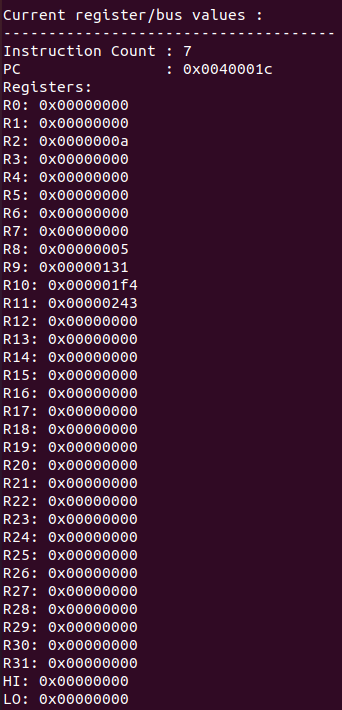

我们使用MARS验证，使用MARS执行汇编程序（.s文件），结果如下：

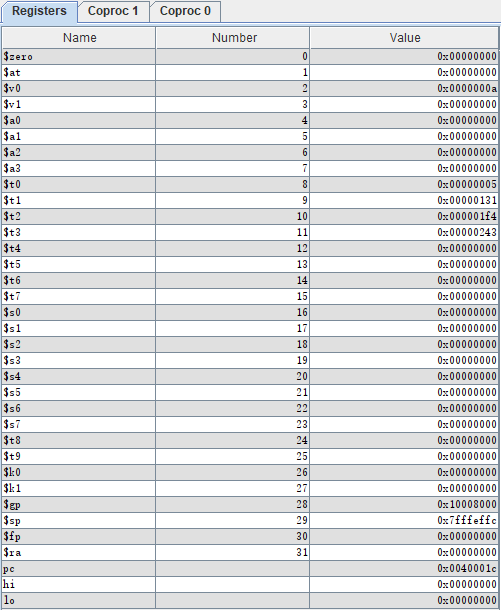

对比结果，可以验证各个寄存器的值全部相同，证明我们仿真平台的正确性。

#### arithtest

执行整个程序，随后保存最后的结果：

```shell
$ src/sim inputs/arithtest.x
$ go
$ rdump
```

SIM程序执行结果：

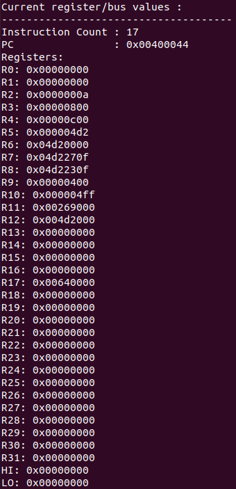

我们使用MARS验证，使用MARS执行汇编程序（.s文件），结果如下：

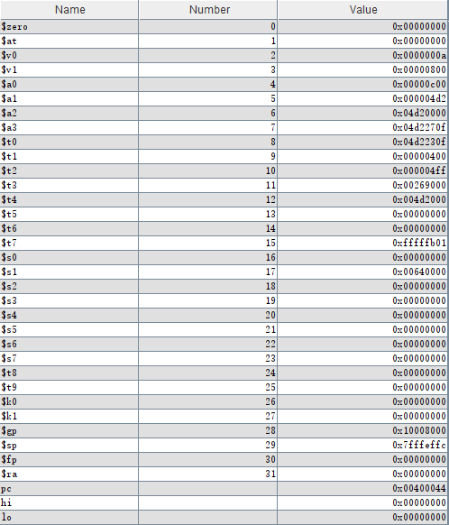

对比结果，可以验证各个寄存器的值全部相同，证明我们仿真平台的正确性。

#### brtest0

执行整个程序，随后保存最后的结果：

```shell
$ src/sim inputs/brtest0.x
$ go
$ rdump
```

SIM程序执行结果：

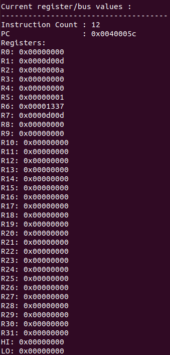

我们使用MARS验证，使用MARS执行汇编程序（.s文件），结果如下：


对比结果，可以验证各个寄存器的值全部相同，证明我们仿真平台的正确性。

有一点需要说明的是，在原本的程序中，1号寄存器不应该被赋值，但在此却出现了不是0的值，其原因在于对于命令的解析：我们所假定的是直接执行命令；而MARS在对可能溢出的addiu执行时，有如下的解释方式：

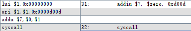

可以看到，addiu被转换为了左边的3个指令来执行，因此1号寄存器作为中间值而被更改，但是只看开始和结果，7号寄存器的值是没有问题的（同时在将.s文件转换为.x文件时转换出的命令也会变成3条，不过lui、ori、addu等命令我们也进行了实现，这还能验证我们这三条命令的正确性）。

#### brtest1

执行整个程序，随后保存最后的结果：

```shell
$ src/sim inputs/brtest1.x
$ go
$ rdump
```

SIM程序执行结果：

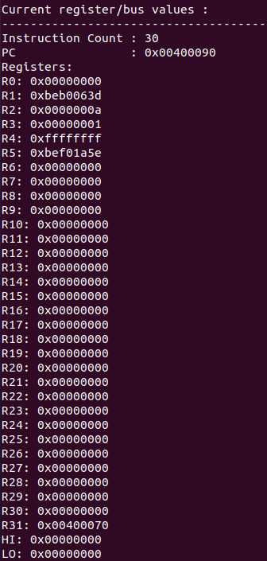

随后使用MARS执行汇编程序，结果如下：

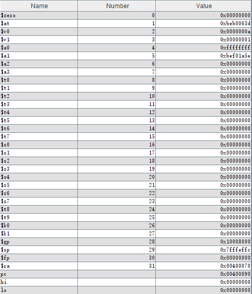

对比结果，可以验证各个寄存器的值全部相同，证明我们仿真平台的正确性。

#### brtest2

执行整个程序，随后保存最后的结果：

```shell
$ src/sim inputs/brtest2.x
$ go
$ rdump
```

SIM程序执行结果：

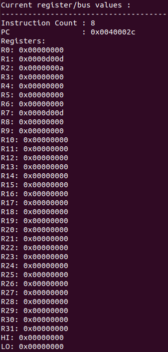

随后使用MARS执行汇编程序，结果如下：

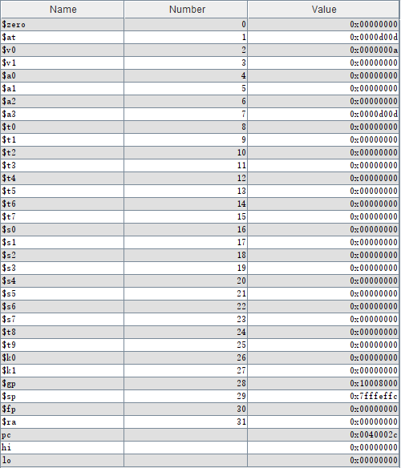

对比结果，可以验证各个寄存器的值全部相同，证明我们仿真平台的正确性。

#### memtest0

执行整个程序，随后保存最后的结果：

```shell
$ src/sim inputs/memtest0.x
$ go
$ rdump
```

SIM程序执行结果：

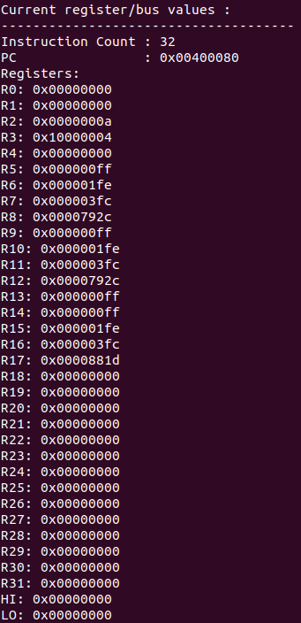

随后使用MARS执行汇编程序，结果如下：

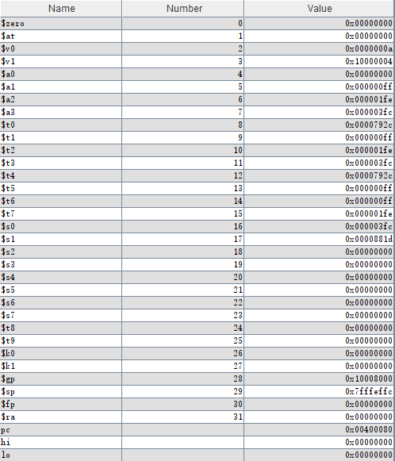

对比结果，可以验证各个寄存器的值全部相同，证明我们仿真平台的正确性。

#### memtest1

执行整个程序，随后保存最后的结果：

```shell
$ src/sim inputs/memtest1.x
$ go
$ rdump
```

SIM程序执行结果：

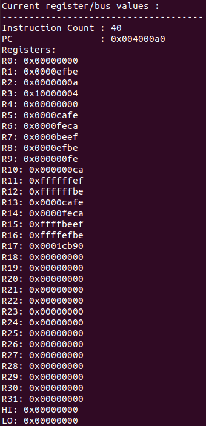

随后使用MARS执行汇编程序，结果如下：

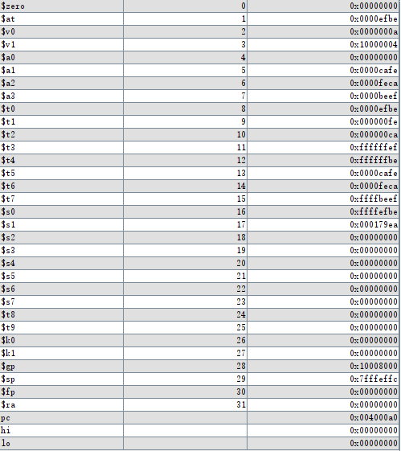

对比结果，可以验证各个寄存器的值全部相同（除了17号），证明我们仿真平台的正确性。

> **在此说明：17号寄存器为9-16号寄存器的值全部加起来的结果，因为实验指导书中明确说明不需要处理溢出，因此其结果与MARS有所不同**

## 结论与结果

经过验证，在不考虑一些条件（根据实验指导书）时，完成了相关指令的sim仿真，通过了所有的test测试。

## 额外的工作

在上面的验证中，有两个寄存器（gp、sp）的值值得注意，但我们的软件仅仅对.text段的代码进行仿真，对于这两个寄存器的值的确定，并不在我们的程序的功能内，因此不作相关的处理。
